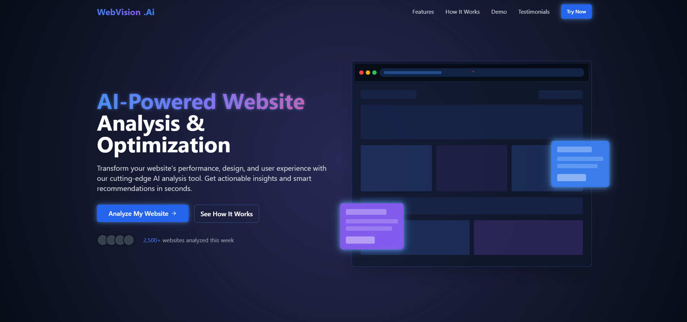

# 🌐 VisionAI Pro

**VisionAI Pro** is an advanced AI-powered platform for comprehensive website analysis and optimization, leveraging **Computer Vision**, **Deep Learning**, and **Large Language Models (LLMs)**. It captures full-page website screenshots, intelligently segments key sections, and provides actionable, data-driven recommendations for design enhancement, content optimization, accessibility improvements, and user experience refinement.

Developed for **AITEX Summit Fall 2025**, VisionAI Pro represents a breakthrough in AI-driven web analytics, empowering businesses, developers, and digital creators to transform their web presence through cutting-edge intelligent insights.

---




## 📽️ Project Demonstration

### Demo Video


https://github.com/user-attachments/assets/df61e459-2166-4a6c-81fa-1ba8f3255164


Watch our comprehensive demonstration showcasing VisionAI Pro's advanced AI-powered website analysis capabilities, including real-time segmentation, performance optimization, and intelligent recommendations.

**Key Highlights:**
- 🎯 AI-driven website analysis in action
- 🧩 Smart section segmentation demonstration
- 📊 Performance metrics and optimization insights
- 💡 Real-world use cases and results

---

## 🎯 Key Purpose

**VisionAI Pro** was created as part of the **AITEX Summit Fall 2025** to address the growing need for intelligent, automated website optimization across multiple industries. It tackles critical challenges including poor website design, limited accessibility, suboptimal user experience, and weak SEO performance. By democratizing access to enterprise-level web analytics through AI, VisionAI Pro empowers organizations of all sizes to create more effective, engaging, and accessible digital experiences.

**Track Focus:** This project aligns with the **AI for Business** track, transforming how companies analyze and optimize their digital presence through advanced automation and analytics.

---

## 🛠 Tech Stack

- **Frontend**:  
  - Vite  
  - React  
  - TypeScript  
  - Tailwind CSS  
  - PostCSS  
  - ESLint  
  - Vercel  

- **Backend**:  
  - Python  
  - OpenCV, PIL, Transformers  
  - Flask  
  - Jupyter-compatible preprocessing

---

## 📂 Project Structure

### Application Architecture – `VisionAI-Pro/`

```
VisionAI-Pro/
├── public/                   # Static assets (images, favicon, etc.)
├── src/                      # React source code
│   ├── components/           # Reusable UI components
│   ├── pages/                # Application pages
│   ├── hooks/                # Custom React hooks
│   ├── lib/                  # Utility libraries
│   ├── segmentation/         # AI analysis backend (Python)
│   │   ├── main.py           # Flask API server
│   │   ├── models/           # AI model configurations
│   │   └── dataset/          # Training and test datasets
│   └── components.json       # Component configurations
├── .gitattributes            # Git attributes for file handling
├── .gitignore                # Git ignore rules
├── eslint.config.js          # ESLint configuration
├── index.html                # Vite entry point HTML
├── package-lock.json         # npm dependency lock file
├── package.json              # Project metadata and dependencies
├── postcss.config.js         # PostCSS configuration for Tailwind
├── tailwind.config.ts        # Tailwind CSS configuration
├── tsconfig.app.json         # TypeScript app configuration
├── tsconfig.json             # Base TypeScript configuration
├── tsconfig.node.json        # TypeScript Node configuration
└── vite.config.ts            # Vite configuration
```

> 🔁 **Note:** The `segmentation/` folder contains the AI analysis engine with Python scripts and machine learning models for intelligent web page analysis.

---

## 🔧 Setup Instructions

### 1. Clone the repository:

```bash
git clone https://github.com/yourusername/VisionAI-Pro
cd VisionAI-Pro
```

### 2. Backend Setup (AI Analysis Engine):

Navigate to the `segmentation/` folder and run the Flask API server:

```bash
cd src/segmentation
pip install -r requirements.txt  # Install Python dependencies
python main.py
```

This launches the Flask backend responsible for AI-powered website analysis, screenshot processing, and intelligent segmentation.

### 3. Frontend Setup:

In the project root (`VisionAI-Pro/`), install dependencies and start the development server:

```bash
npm install
npm run dev
```

### 4. Open in Browser:

```
http://localhost:8080
```

### 5. Production Build:

```bash
npm run build
```

---

## 📡 Features

- 🖼️ **Intelligent Screenshot Capture** - Full-page website rendering with adaptive scaling
- 🧩 **AI-Powered Segmentation** - Deep learning-based section detection and classification
- 📝 **Advanced Text Analysis** - Readability scoring, SEO optimization, and content quality assessment
- 🎨 **Design Intelligence** - Automated UX/UI improvement recommendations using computer vision
- 🖌️ **Content Optimization** - Smart suggestions for image optimization and accessibility enhancements
- ⚡ **Real-time Processing** - Fast, responsive UI with instant feedback
- 📊 **Comprehensive Reporting** - Detailed analytics dashboards with actionable insights
- 🔒 **Privacy-First Architecture** - Secure analysis without storing sensitive data  

## 📄 License

This project is licensed under the [MIT License](LICENSE).

